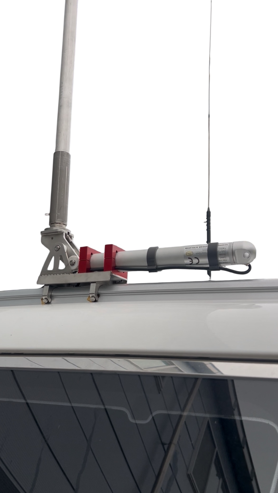
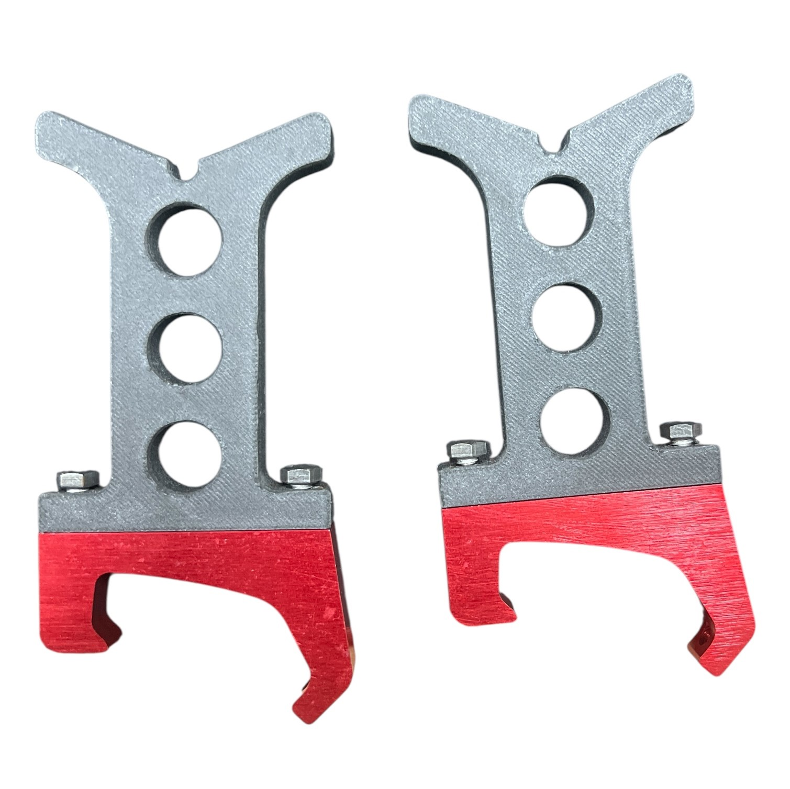

  <h2 style="color: #1d5fa8;">📡 파워 안테나 리프트</h2>
  
<strong>– SUS304 본체 / 92.6Nm 고토크 대응 / 리니어 액추에이터 구동 –</strong>

  
  

  <h3 style="color:#1d5fa8;">✅ 제품 개요</h3>
  

    파워 안테나 리프트는 차량 루프에 장착하여 HF/VHF/UHF 안테나를 자동으로 수평·수직 전환할 수 있는 고강도 전동 리프트입니다.
    SUS304 스테인리스 본체로 제작되어 내부식성과 내구성이 우수하며, 스크류 타입 리니어 액추에이터(별도구매)를 장착하여 구동합니다.
  

  
  

  <h3 style="color:#1d5fa8;">🔧 주요 특징</h3>
  <ul>
    <li><strong>구동 방식:</strong> 스크류 타입 리니어 액추에이터 장착형 (※ 수입품 별도구매)</li>
    <li><strong>정격 토크 대응:</strong> 92.6Nm 이하</li>
    <li><strong>재질:</strong> 본체 SUS304 스테인리스 – 우수한 내부식성</li>
    <li><strong>전원:</strong> DC 12V 전용 (ACC 연동 or 배터리 직결)</li>
    <li><strong>제어 방식:</strong> 유선 스위치 / 무선 리모컨 지원 (※ 수입품 별도구매)</li>
    <li><strong>전용 브라켓 포함:</strong> 카니발 시리즈 3종 대응</li>
  </ul>

  
  <li><strong>전용 브라켓 :</strong> 올뉴카니발, 더뉴카니발</li>
  
  <li><strong>전용 브라켓 :</strong> 그랜드카니발</li>

  <h3 style="color:#1d5fa8;">🚗 지원 차량</h3>
  <ul>
    <li>더 뉴 카니발 (YP)</li>
    <li>올 뉴 카니발 (YP)</li>
    <li>그랜드 카니발 (VQ)</li>
  </ul>
  
※ 그 외 차종(쏘렌토, 스타렉스 등)은 요청 시 맞춤 브라켓 제작 가능합니다. - 별도금액

  
  

  <h3 style="color:#1d5fa8;">📐 제품 사양</h3>
  <table style="width:100%; border-collapse: collapse; margin-bottom: 20px;">
    <tbody>
      <tr><td style="border:1px solid #ccc; padding:8px;">제품명</td><td style="border:1px solid #ccc; padding:8px;">파워 안테나 리프트</td></tr>
      <tr><td style="border:1px solid #ccc; padding:8px;">구동 방식</td><td style="border:1px solid #ccc; padding:8px;">스크류 타입 리니어 엑추에이터</td></tr>
      <tr><td style="border:1px solid #ccc; padding:8px;">정격 토크</td><td style="border:1px solid #ccc; padding:8px;">92.6 Nm 이하</td></tr>
      <tr><td style="border:1px solid #ccc; padding:8px;">재질</td><td style="border:1px solid #ccc; padding:8px;">SUS304 스테인리스 / 아노다이징 알루미늄</td></tr>
      <tr><td style="border:1px solid #ccc; padding:8px;">전원</td><td style="border:1px solid #ccc; padding:8px;">DC 12V 전용 (ACC 또는 배터리 연결)</td></tr>
      <tr><td style="border:1px solid #ccc; padding:8px;">제어 방식</td><td style="border:1px solid #ccc; padding:8px;">유선 스위치 / 무선 리모컨 (별도구매)</td></tr>
      <tr><td style="border:1px solid #ccc; padding:8px;">크기</td><td style="border:1px solid #ccc; padding:8px;">전체 길이 386mm / 높이 108mm</td></tr>
    </tbody>
  </table>

  
 

  <h3 style="color:#1d5fa8;">🧩 선택 옵션 (별도 구매)</h3>
  <ul>
    <li>리니어 액추에이터 – 12V, 50mm Stroke Speed 7mm/s, 2500N 이상 권장 <strong> (별도안내)</strong></li>
    <li>유선 스위치 또는 무선 리모컨 제어 키트 <strong>(별도안내)</strong>  </li>
    <li>아노다이징 색상 선택 <strong>(실버 / 블랙 / 레드 ) - 옵션</strong></li>
    <li>콜사인 플레이트 각인 <strong>(※ 전용 브라켓 장착 시에만 적용 가능)</strong></li>
    <li>전용 브라켓 커스터마이징 <strong>스타렉스, 쏘렌토 등 요청 가능(옵션)</strong></li>
    <li>기지국용 안테나 보강 브라켓 및 기지국 안테나 브라켓 <strong>(3단 GP안테나, HF 수직형 안테나)</strong></li>
    <li>안테나 받침대 <strong>(알루미늄, 3D 프린팅 파트)</strong></li>
  </ul>
  <li>콜사인 플레이트 <strong>(SUS304 레이져 각인)</strong></li>
  
  <li>기지국 안테나 브라켓 <strong>(별도 주문 사양)</strong></li>
  
  <li>기지국 안테나 예시 <strong>(7.1m 수직형 안테나)</strong></li>
  
  <li>안테나 받침 브라켓 <strong>(알루미늄 및 3D 프린팅 파트)</strong></li>
  

  <h3 style="color:#1d5fa8;">📦 구성품</h3>

  <ul>
    <li>기본 세트 구성품</li>
    
1. SUS304 본체 프레임 1세트

    
2. 고정용 볼트·와셔 세트

    
3. PDF 설치 가이드

    
  </ul>
  <ul>
    <li>풀 세트 구성품</li>
    
1. SUS304 본체 프레임 1세트

    
2. 고정용 볼트·와셔 세트

    
3. 더뉴, 올뉴, 그랜드 카니발 전용 브라켓

    
4. 안테나 받침 브라켓

    
5. PDF 설치 가이드

    
  </ul>
  
<strong>⚠ 리니어 액추에이터 및 제어장치는 포함되지 않습니다.</strong>

  <h3 style="color:#1d5fa8;">📞 문의 및 주문</h3>
  

    📧 이메일: triccc@naver.com 
    📱 카카오톡 오픈채팅방: <strong>https://open.kakao.com/o/gb3m2DEh</strong> 
    

    💬 전국 배송 (배송비 별도)
  

